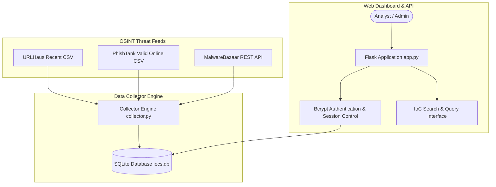

# ThreatCollector — Threat Intelligence Platform for IoC Collection & Search

> **Status**: 🔵 Completed Prototype  
> **Target Identity**: ThreatCollector  
> **License**: MIT License ([LICENSE](LICENSE))  

ThreatCollector is a lightweight, automated cybersecurity threat intelligence platform designed to ingest, store, search, and manage Indicators of Compromise (IoCs) collected from open OSINT threat intelligence feeds.

---

## Overview

Security Operations Centers (SOCs) and threat analysts need centralized repositories to collect and query malicious URLs, phishing domains, and file hashes. **ThreatCollector** provides an automated collection pipeline that ingests indicators from feeds like **URLHaus**, **PhishTank**, and **MalwareBazaar**, persisting them to an SQLite database with role-based dashboard controls (`admin`, `user`).

---

## Why I Built It

I built ThreatCollector to explore cybersecurity application development, automated OSINT threat data ingestion, password hashing, and analyst query workflows. Building ThreatCollector required implementing HTTP feed scrapers, handling API responses, enforcing database deduplication via SQLite unique keys, and protecting sensitive endpoints with Bcrypt password hashing.

---

## Architecture & Data Flow



---

## Key Features & Systems Design

- **Multi-Feed Ingestion Engine**: `collector.py` automatically fetches and parses real-time threat indicators from URLHaus, PhishTank, and MalwareBazaar.
- **Deduplication & Persistence**: SQLite storage engine (`database.py`) enforcing unique constraint checks to prevent duplicate indicator storage.
- **Bcrypt Password Security**: Hashing user passwords via `Flask-Bcrypt` with secure verification before establishing authenticated session cookies.
- **Role-Based Access Control**:
  - `Admin`: Full access to manually add IoCs, inspect feeds, and manage user roles.
  - `User`: Analysts can search indicators, inspect recent threat entries, and query domain reputations.
- **Instant Search Engine**: `/search` endpoint supporting fast database lookups by malicious URL, domain, or SHA-256 hash.

---

## Technical Stack

| Layer | Technologies |
|---|---|
| **Backend & Web Framework** | Python 3.10+, Flask 3.x, Werkzeug |
| **Authentication & Security** | `Flask-Bcrypt`, `Flask-Login`, SQLite3 |
| **Ingestion & Data Feeds** | `requests`, `APScheduler` |
| **Frontend UI** | HTML5, CSS3, Server-Rendered Jinja2 Templates |
| **Testing & Quality** | Python standard `unittest` framework |

---

## Repository Structure

```
ti-collector/
├── static/                     # CSS stylesheets & client assets
├── templates/                  # Jinja2 HTML template views (login, admin, search)
├── tests/
│   ├── test_collector.py       # Core database & auth unit tests
│   └── test_resilience.py      # Feed parsing & network error resilience tests
├── app.py                      # Flask REST API & session routing
├── collector.py                # Ingestion script for URLHaus, PhishTank, & MalwareBazaar
├── database.py                 # SQLite database schema & query functions
├── .env.example                # Safe environment variable configuration template
├── LICENSE                     # MIT License
└── requirements.txt            # Dependency requirements
```

---

## Installation & Setup

### Prerequisites
- Python 3.10+

### Setup Virtual Environment

```bash
# Clone repository
git clone https://github.com/Balu-Annapureddy/ti-collector.git
cd ti-collector

# Create virtual environment
python -m venv .venv

# Activate virtual environment
# Windows (PowerShell):
.\.venv\Scripts\Activate.ps1
# Linux/macOS:
# source .venv/bin/activate

# Install dependencies
pip install -r requirements.txt
```

---

## Usage

### 1. Run Automated IoC Collector

Ingest recent threat indicators from public feeds into local database:

```bash
python collector.py
```

### 2. Start Web Application

Launch the Flask development server:

```bash
python app.py
```

Open `http://localhost:5000` in your browser. Register a user or admin account to access the dashboard.

---

## Testing

Automated tests are located in `tests/` (6 unit tests covering SQLite database initialization, user authentication, IoC insertion, search querying, feed parsing error resilience, and route authorization).

Run the test suite:

```bash
.\.venv\Scripts\python.exe -m unittest discover tests
```

---

## Security Audit Notice

An audit of source files found no obvious hardcoded credentials. Flask secret key configuration dynamically reads `SECRET_KEY` from environment variables with local development fallbacks.

---

## Limitations

- **Storage Engine**: Configured for local SQLite database deployment; high-volume production threat intelligence environments would use PostgreSQL or Elasticsearch.
- **Feed Rate Limits**: Scraping public threat feeds relies on external API availability and default HTTP timeout settings (20s).

---

## License

This project is licensed under the MIT License — see the [`LICENSE`](LICENSE) file for details.
